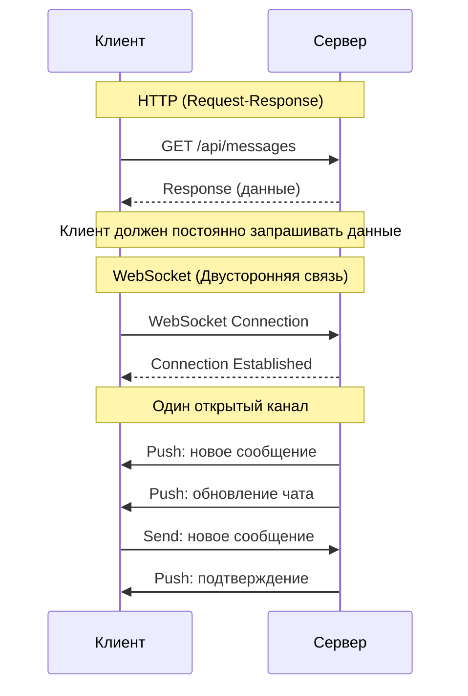
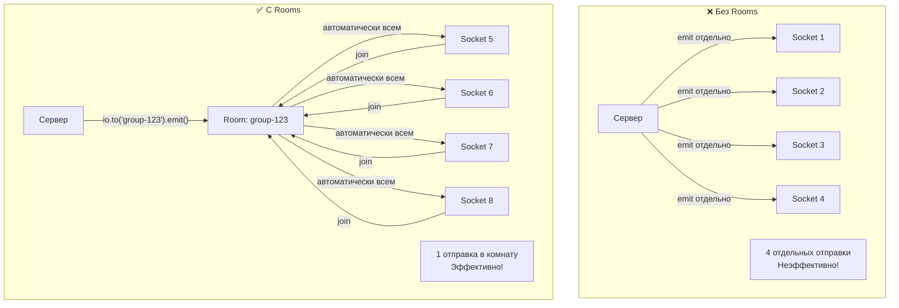
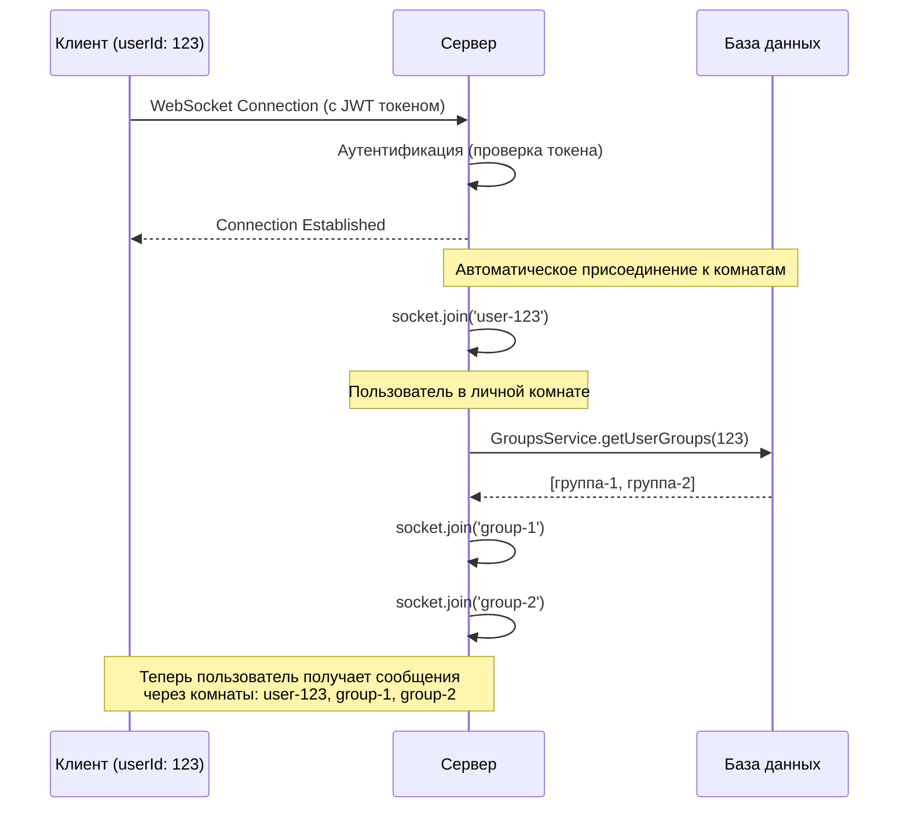
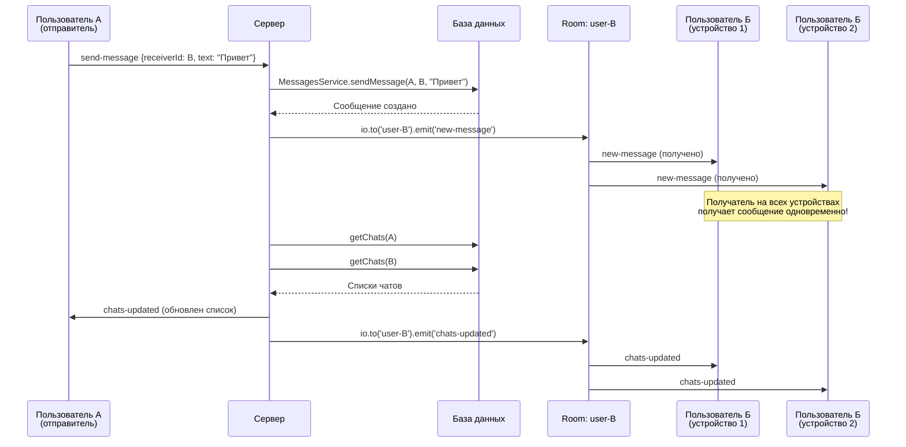
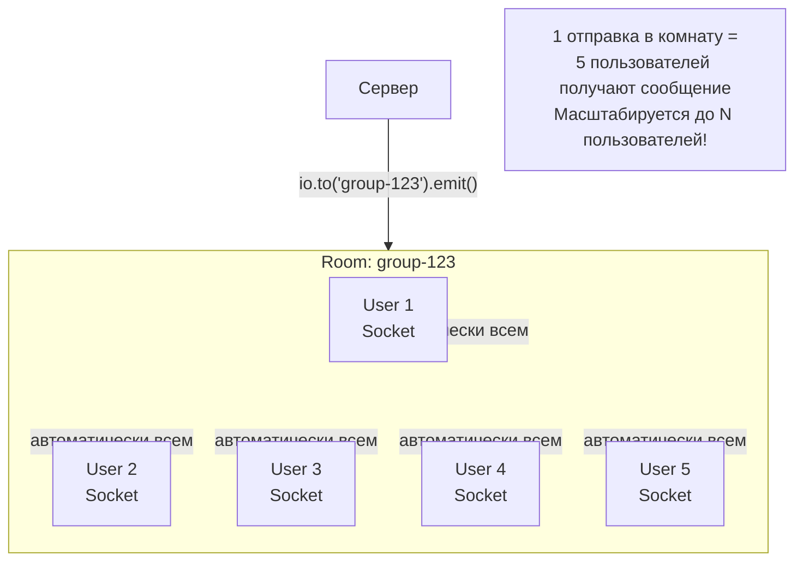
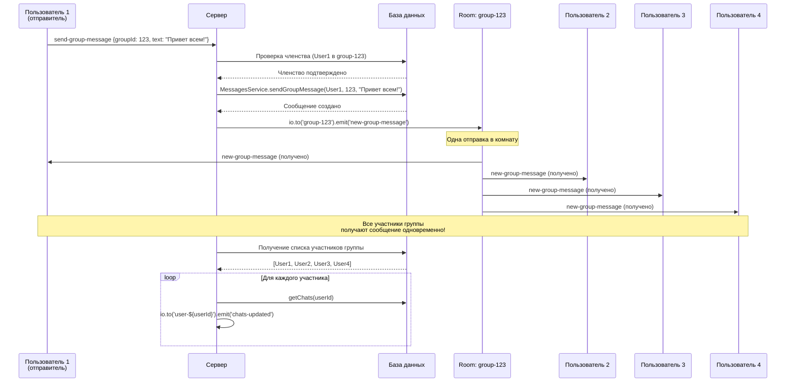
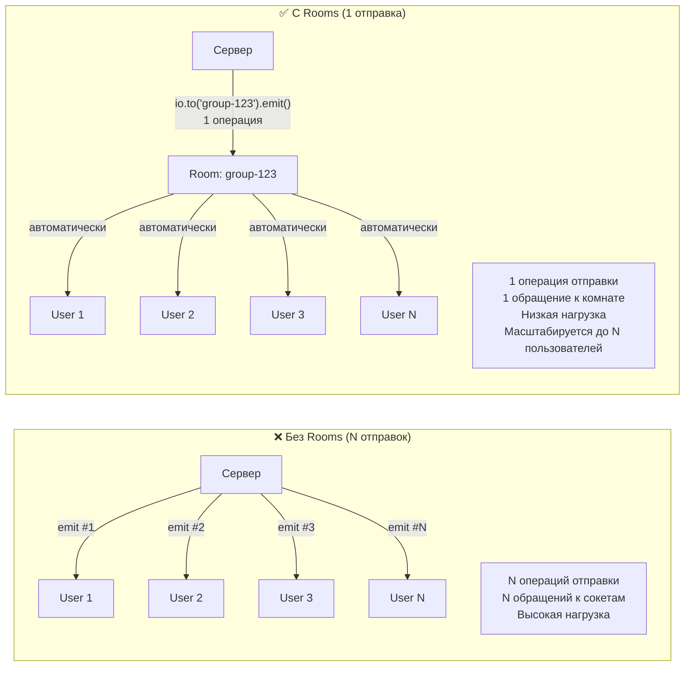

# Доклад: WebSockets и Rooms в проекте GetLucky

**Время: 5-10 минут**

---

## 1. Что такое WebSockets? (1-2 минуты)

### Краткое объяснение:

**WebSockets** - это протокол двусторонней связи между клиентом и сервером. В отличие от обычного HTTP, где клиент всегда инициирует запрос, WebSocket позволяет серверу отправлять данные клиенту в реальном времени без необходимости постоянных запросов.

### Основные преимущества:

- ✅ **Реальное время** - мгновенная передача данных
- ✅ **Эффективность** - один открытый канал вместо множества HTTP-запросов
- ✅ **Двусторонняя связь** - сервер может отправлять данные клиенту

### Сравнение HTTP и WebSocket:



### В нашем проекте:

Мы используем **Socket.io** - библиотеку для работы с WebSockets, которая упрощает реализацию и добавляет полезные функции (переподключение, rooms и др.)

---

## 2. Что такое Rooms? (2-3 минуты)

### Концепция Rooms:

**Rooms** - это способ группировки клиентских подключений (sockets). Вместо того, чтобы отправлять сообщения каждому клиенту отдельно, вы можете отправить сообщение всем участникам комнаты одновременно.

### Зачем нужны Rooms?

**Без Rooms:**

```javascript
// Плохо: нужно отправлять каждому участнику отдельно
socket1.emit("message", data);
socket2.emit("message", data);
socket3.emit("message", data);
// ... и так для каждого пользователя
```

**С Rooms:**

```javascript
// Хорошо: отправляем один раз всей комнате
io.to("room-name").emit("message", data);
// Все участники комнаты получат сообщение автоматически
```

### Визуализация концепции Rooms:



### Типы Rooms в нашем проекте:

1. **Личные комнаты** (`user-${userId}`)

   - Каждый пользователь имеет свою комнату
   - Используется для отправки сообщений конкретному пользователю
   - Пример: `user-123` - комната пользователя с ID 123

2. **Групповые комнаты** (`group-${groupId}`)
   - Комнаты для групповых чатов
   - Все участники группы автоматически присоединяются
   - Пример: `group-456` - комната группы с ID 456

---

## 3. Реализация в проекте GetLucky (4-5 минут)

### 3.1 Настройка WebSocket на сервере

**Файл: `server/src/socket/socketHandler.js`**

#### При подключении пользователя:

```javascript
io.on("connection", async (socket) => {
  const { userId } = socket;

  // 1. Присоединяем пользователя в его личную комнату
  socket.join(`user-${userId}`);

  // 2. Получаем все группы пользователя
  const userGroups = await GroupsService.getUserGroups(userId);

  // 3. Присоединяем ко всем группам автоматически
  userGroups.forEach((groupChat) => {
    socket.join(`group-${groupChat.group.id}`);
  });
});
```

**Что происходит:**



- При подключении пользователь автоматически попадает в свою личную комнату
- Затем он автоматически присоединяется ко всем группам, в которых состоит
- Теперь сервер может отправлять ему сообщения через эти комнаты

---

### 3.2 Отправка личных сообщений через Rooms

**Сценарий:** Пользователь А отправляет сообщение пользователю Б

#### Серверная часть:

```javascript
socket.on("send-message", async (data) => {
  const { receiverId, text } = data;
  const userId = socket.userId;

  // 1. Создаем сообщение в базе данных
  const message = await MessagesService.sendMessage(
    userId,
    receiverId,
    text.trim()
  );

  // 2. Отправляем сообщение получателю через его личную комнату
  io.to(`user-${receiverId}`).emit("new-message", message);

  // 3. Обновляем список чатов для обоих пользователей
  const senderChats = await MessagesService.getChats(userId);
  const receiverChats = await MessagesService.getChats(receiverId);

  io.to(`user-${userId}`).emit("chats-updated", senderChats);
  io.to(`user-${receiverId}`).emit("chats-updated", receiverChats);
});
```

**Ключевой момент:**

```javascript
io.to(`user-${receiverId}`).emit("new-message", message);
```

Эта строка отправляет сообщение всем подключениям пользователя с `receiverId`. Если пользователь открыт на нескольких устройствах - он получит сообщение везде!

### Поток отправки личного сообщения:



---

### 3.3 Отправка групповых сообщений через Rooms

**Сценарий:** Пользователь отправляет сообщение в групповой чат

### Структура комнат для групповых сообщений:



#### Серверная часть:

```javascript
socket.on('send-group-message', async (data) => {
  const { groupId, text } = data;
  const userId = socket.userId;

  // 1. Проверяем, что пользователь состоит в группе
  const membership = await GroupMember.findOne({
    where: { groupId, userId }
  });

  if (!membership) {
    return socket.emit('error', {
      message: 'Вы не являетесь участником этой группы'
    });
  }

  // 2. Создаем сообщение в базе данных
  const message = await MessagesService.sendGroupMessage(
    userId,
    groupId,
    text.trim()
  );

  // 3. Отправляем ВСЕМ участникам группы через комнату
  io.to(`group-${groupId}`).emit('new-group-message', message);

  // 4. Обновляем список чатов для всех участников
  const members = await GroupMember.findAll({
    where: { groupId }
  });

  members.forEach((member) => {
    const chats = await MessagesService.getChats(member.userId);
    io.to(`user-${member.userId}`).emit('chats-updated', chats);
  });
});
```

**Ключевой момент:**

```javascript
io.to(`group-${groupId}`).emit("new-group-message", message);
```

Одна строка отправляет сообщение всем участникам группы, независимо от их количества! Если в группе 100 человек - все получат сообщение одновременно.

### Поток отправки группового сообщения:



---

### 3.4 Динамическое присоединение к группам

**Сценарий:** Пользователь присоединяется к новой группе

```javascript
socket.on("join-group", async (data) => {
  const { groupId } = data;
  const userId = socket.userId;

  // 1. Проверяем членство
  const membership = await GroupMember.findOne({
    where: { groupId, userId },
  });

  if (!membership) {
    return socket.emit("error", {
      message: "Вы не являетесь участником этой группы",
    });
  }

  // 2. Присоединяем к комнате группы
  socket.join(`group-${groupId}`);

  socket.emit("joined-group", { groupId });
});
```

**Что происходит:**

- Пользователь присоединяется к комнате группы
- Теперь он будет получать все сообщения этой группы
- Если он выходит из группы, можно использовать `socket.leave()`

---

### 3.5 Клиентская часть

**Файл: `client/src/shared/lib/socketInstance.ts`**

#### Инициализация соединения:

```typescript
export function initSocket(token: string): Socket {
  socket = io(socketUrl, {
    auth: {
      token, // Аутентификация через JWT токен
    },
    transports: ["websocket", "polling"],
    reconnection: true,
  });

  return socket;
}
```

#### Использование в компонентах:

**Файл: `client/src/components/pages/ChatPage.tsx`**

```typescript
useEffect(() => {
  const socket = initSocket(token);

  // Слушаем новые сообщения
  socket.on("new-message", (newMessage: Message) => {
    if (
      newMessage.senderId === friendIdNum ||
      newMessage.receiverId === friendIdNum
    ) {
      setMessages((prev) => [...prev, newMessage]);
    }
  });

  // Слушаем обновления списка чатов
  socket.on("chats-updated", (chats: Chat[]) => {
    // Обновляем UI
  });

  return () => {
    socket.off("new-message");
    socket.off("chats-updated");
  };
}, [friendId]);
```

---

## 4. Преимущества использования Rooms

### Сравнение эффективности:



### ✅ Эффективность

- Одно сообщение вместо множества отправок
- Меньше нагрузки на сервер

### ✅ Масштабируемость

- Легко добавлять новых участников
- Работает с любым количеством пользователей

### ✅ Простота кода

```javascript
// Вместо цикла по всем пользователям:
io.to("group-123").emit("message", data);

// Это проще и эффективнее, чем:
members.forEach((member) => {
  io.to(`user-${member.id}`).emit("message", data);
});
```

### ✅ Гибкость

- Пользователь может быть в нескольких комнатах одновременно
- Легко добавлять/удалять пользователей из комнат

---

## 5. Итоги и выводы

### Что мы реализовали:

1. ✅ **Личные комнаты** для отправки сообщений конкретным пользователям
2. ✅ **Групповые комнаты** для групповых чатов
3. ✅ **Автоматическое присоединение** к комнатам при подключении
4. ✅ **Динамическое управление** (присоединение/выход из групп)
5. ✅ **Реальное время** - сообщения приходят мгновенно

### Результат:

- Мгновенная доставка сообщений
- Эффективное использование ресурсов
- Простой и понятный код
- Готовность к масштабированию

---

## Дополнительные примеры кода

### Отправка сообщения конкретному пользователю:

```javascript
io.to(`user-${userId}`).emit("new-message", message);
```

### Отправка всем участникам группы:

```javascript
io.to(`group-${groupId}`).emit("new-group-message", message);
```

### Отправка всем, кроме отправителя:

```javascript
socket.broadcast.to(`group-${groupId}`).emit("message", data);
```

### Проверка, находится ли пользователь в комнате:

```javascript
const sockets = await io.in(`group-${groupId}`).fetchSockets();
// Получаем список всех подключений в комнате
```

---

**Спасибо за внимание! Вопросы?**
